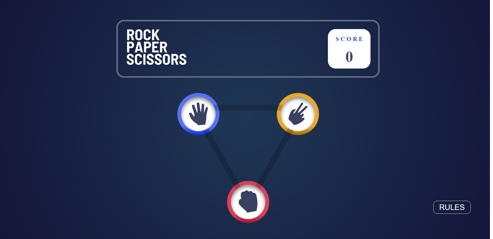

# Rock Paper Scissors

- [Features](#features)
- [Technologies](#technologies)
- [Live Demo](#live-demo)
- [Screenshots](#screenshots)
- [How to Use](#how-to-use)
- [Contributing](#contributing)
- [License](#license)

The rock-paper-scissors game is fully functional, designed with Sass, and developed with ractjs

## <a id="features">Features</a>

- Responsiveness that perfectly adjusts to both desktop and mobile screens.
- Fully styled using Sass.
- Screen changes loaded by react routes.
- Score changes made by useState.
- Button to display the rules at any time during the game.
- Play against the computer, which makes random moves.
- Score board that reset when the player refresh the page.

## <a id="technologies">Technologies Used</a>
- React
- JavaScript
- SASS

## <a id="live-demo">Live demo</a>

Try the live version of the page [here](https://rock-paper-scissors-react-ten.vercel.app/)

## <a id="screenshots">Sceenshots</a>

Here are some screenshots of the game in action: 

## <a id="how-to-use">How to use it</a>
- Clone the repository
- Open your terminal and navigate to the project directory
- Run npm install to install all the dependencies
- Run npm start to start the development server
- Open http://localhost:3000 to view it in the browser.

## <a id="contributing">Contribute</a>

Feel free to submit pull requests or issues if you have suggestions for improvements. This is a practice project and any feedback is welcome.

## <a id="license">License</a>

This project is lincensed under the MIT license.
